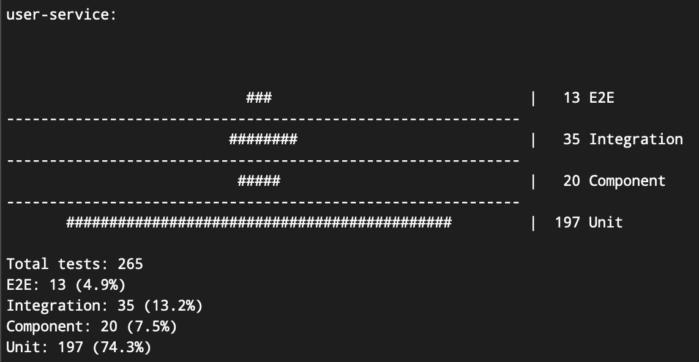

# Test Pyramid Generator

This Python script generates a visual representation of the test pyramid for a given repository, counting tests across different layers of the testing strategy.

## Features

- Walks through specified directories to count tests
- Supports multiple file patterns and content patterns for test identification
- Generates a ASCII-based pyramid visualization of the test distribution
- Calculates and displays test counts and percentages for each layer

## Usage

1. Modify the `repos` list in the script to include the repositories and their respective test layers you want to analyze.

2. For each repository, define the following:
   - `name`: Name of the repository
   - `layers`: A list of dictionaries, each representing a layer in the test pyramid

3. For each layer, specify:
   - `name`: Name of the layer (e.g., "Unit", "Component", "Integration", "E2E")
   - `path`: Directory path to search for tests
   - `file_patterns` (optional): List of regex patterns to match file names
   - `file_content_patterns` (optional): List of regex patterns to match file content
   - `test_patterns` (optional): List of regex patterns to identify individual tests within files

4. Run the script:
   - `python test_pyramid_generator.py`

## Output

The script will generate a visual representation of the test pyramid for each repository, including:

- ASCII-based pyramid showing the distribution of tests across layers
- Total test count
- Test count and percentage for each layer

## Example Output

## Customization

You can easily customize the script by modifying the `repos` list to include different repositories or by adjusting the layer definitions to match your project's structure.